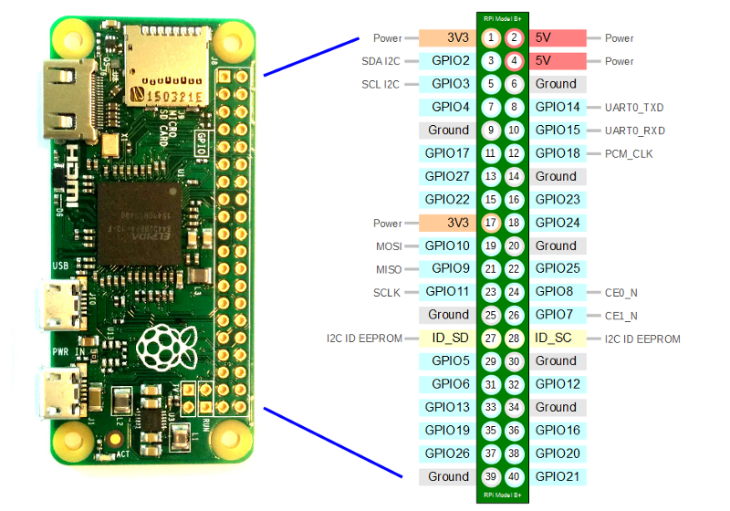

# dbox-app

[](https://codecov.io/gh/PseudoDesign/dbox_app)

An application for running a simple lock box on a RaspberryPi.

The device hardware consists of:
  * A GPIO controlled latch
  * An RGB LED to indicate status
  * A single pushbutton

## Usage

This application provides the `dbox-app` entrypoint.  This is intended to be run as a systemd service.
Use `dbox-app --help` for information on running the application.

### Config File

The config file provides the hardware configuration for the device.  The default location for the configuration file is `/etc/dbox/conf.yml`, but this 
can be modified from the command line option `-c`.

An example config file is shown below

```yaml
# RPI GPIO number for the latch control pin
latch: 17
# RPI GPIO number for the pushbutton
button: 18
# RPI GPIO numbers for the RGB LEDs
led_r: 2
led_g: 4
led_b: 3
# Location of the lock file
lock_file: /nvm/lock.yaml
```

RPi GPIO numbers for the RPi Zero are shown below.



## Developers Guide

### Set up development environment

* Install the latest release of [Python](https://www.python.org/downloads/)
* Installed the required packages with `python3 -m pip install -r requirements.txt`

### Running Tests

#### Behavior Tests

The majority of the tests are Behavior tests using the Behave library and are located in the `features` directory.
You can run them by executing `behave` from the command line.

#### Unit Tests

Some modules (particularly the secure lock module) use Unit Tests instead of behavior tests.  You can execute them with
`python3 -m unittest tests/*` from the command line.

#### Software Design

This software is a hobbyist project that's still in development.  For now, the documentation is limited to
type hints and docstrings located in the source code.

#### Hardware Design

TBD.  This project hit a snag with the latch used on the lockbox being susceptible to unlocking with a strong magnet.

There's a Yocto meta layer for installing this project located here: `https://github.com/PseudoDesign/meta-dbox`
